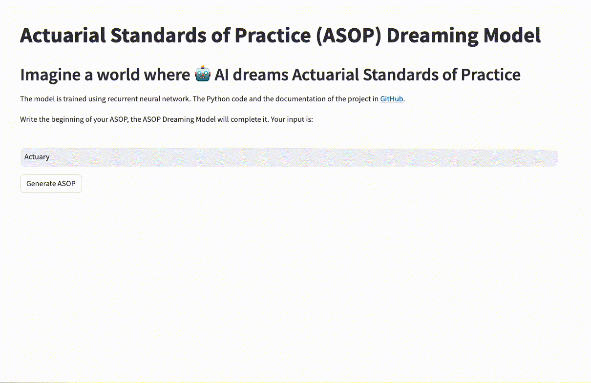
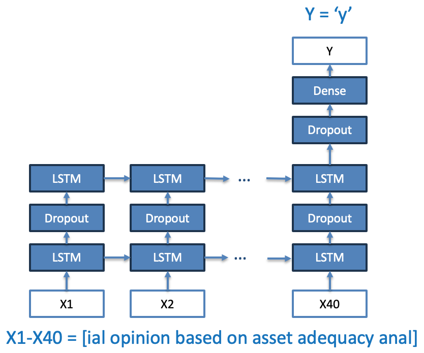

# Actuarial Standards of Practice (ASOP) Dreaming Language Model using Recurrent Neural Network

## Description
Welcome to the ASOP Dreaming Language Model! 
The project is to create a recurrent neural network (RNN) that generates dreamy and illusional Actuarial Standards of Practice.

This project is for fun and educational purposes only. If an alien had access to ASOP documents and learned about them, it may have produced something similar to this model!

The network predicts the next character in a sequence by analyzing the previous 40 characters as input. Think of it like carrying on a conversation where you guess the following word (character in this model) based on the previous 40 words (or characters in this model). The model does not use any embedding or does not have a concept of a token since it is trained at a character level.

The model was trained on a small dataset of about 800,000 characters (about 1MB) extracted from "Actuarial Standards of Practice" (ASOP) by the Actuarial Standards Board. The data was divided into "windows" of 41 characters for training: 40 for input and 1 for the desired output (the next character).

Although a relatively small neural network, it contains around 3 million parameters. It took about 5 hours to train on an Apple M2 Pro chip going through 21 epochs. The `model` folder includes a [pre-trained model](./model) so you can quickly deploy and generate ASOPs without training yourself. The code is available for you to train on any text documents.

Please see the [Jupyter Notebook](./notebook/ASOP_RNN.ipynb) in the `notebook` folder for further descriptions of the model and underlying codes.  
The Streamlit implementation Python code is [here](ASOP_RNN_Streamlit.py).

## What the model output looks like

Please visit the Streamlit web app [(https://asop-dream.streamlit.app/)](https://asop-dream.streamlit.app/) and run the model yourself!

The model is hallucinating. However, ASOP may appear like this for non-actuaries!

The following animated GIF shows multiple illustrative instances.

## Model structure

1. **Model Type: "Recurrent Neural Network"**
   - A Recurrent Neural Network (RNN) is a type of artificial neural network designed to recognize patterns in sequences of data, such as text, genomes, handwriting, or numerical time series data from market indicators or sensors. The RNN processes inputs with a dependency structure allowing information to persist within the network; in other words, the network creates a sort of memory of previous inputs in its internal state. 

2. **First Layer: LSTM**
   - The first layer is an LSTM (Long Short-Term Memory) layer with 512 units. LSTM is a type of artificial neural network used in deep learning which is especially good at remembering information for long periods. This layer takes sequences as input and outputs a sequence of the same length (40 time steps here), and with 512 units at each time step.

3. **Second Layer: Dropout**
   - Right after the first LSTM, there's a Dropout layer. Dropout is a simple yet effective technique used to prevent the model from overfitting. This layer randomly sets input units to 0 with a certain frequency (50%) during training, helping generalization.

4. **Third Layer: LSTM**
   - There's another LSTM layer, also with 512 units. However, this time it outputs a single 512-feature vector instead of a sequence.

5. **Fourth Layer: Dropout**
   - Another Dropout layer to prevent overfitting.

6. **Fifth Layer: Dense**
   - The final layer is a Dense (or fully connected) layer with 69 units and 69 feature outputs. The output leads to predicting a character among 69 unique characters.

## Author
Dan Kim 

- [@LinkedIn](https://www.linkedin.com/in/dan-kim-4aaa4b36/)
- dan.kim.actuary@gmail.com (feel free to reach out with questions or comments)

## Date
- Initially published on 2/10/2024
- The contents may be updated from time to time
  
## License
This project is licensed under the Apache 2.0 License - see the LICENSE.md file for details.

## Acknowledgments
1. A large portion of the code was referenced from an exercise in DeepLearning AI's Sequence Models online course. Thank you, Andrew Ng and folks, for the awesome educational content! https://www.coursera.org/learn/nlp-sequence-models/
2. This project was inspired by the work of Andrej Karpathy. You can find his code implementation here: https://gist.github.com/karpathy/d4dee566867f8291f086
3. Read more about "The Unreasonable Effectiveness of Recurrent Neural Networks" in Andrej Karpathy's blog post: https://karpathy.github.io/2015/05/21/rnn-effectiveness/
4. Actuarial Standards of Practice, Actuarial Standards Board: https://www.actuarialstandardsboard.org/standards-of-practice/
5. ASOP downloaded as of December 2023: http://www.actuarialstandardsboard.org/wp-content/uploads/2023/12/ASOPs-as-of-Decemeber-2023.zip
