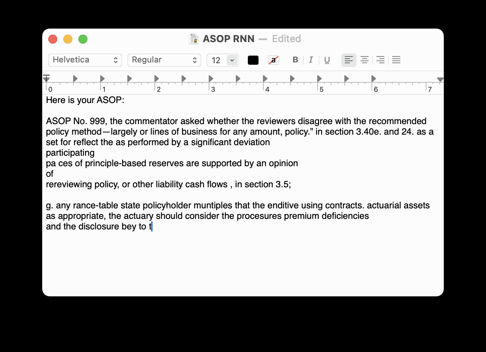

# Actuarial Standards of Practice (ASOP) Dreaming Language Model using Recurrent Neural Network

## Description

Welcome to the ASOP Dreaming Language Model! 
The project shows codes to create a recurrent neural network (RNN) that generates dreamy and illusional Actuarial Standards of Practice.

This project is for fun and educational purposes only. If an alien had access to ASOP documents and learned about them, it may have produced something similar to this model!

The network predicts the next character in a sequence by analyzing the previous 40 characters as input. Think of it like carrying on a conversation where you guess the next word based on the previous 40 words.

It is trained on a small dataset of 800,000 characters (about 1MB) extracted from "Actuarial Standards of Practice" (ASOP) by the Actuarial Standards Board. The data was divided into "windows" of 41 characters for training: 40 for input and 1 for the desired output (the next character).

Although a relatively small neural network, it contains around 3 million parameters. It took about 5 hours to train on an Apple M2 Pro chip going through 21 epochs. The model folder includes a pre-trained model so you can easily deploy and generate ASOPs without having to train yourself.

Please see the Jupyter Notebook in the notebook folder for further descriptions of the model.

## What the model output looks like
The model is hallucinating. However, ASOP may appear like this for non-actuaries!

## Author
Dan Kim 

- [@Dan Kim](https://github.com/DanTCIM)
- dan.kim.actuary@gmail.com

## License

This project is licensed under the Apache 2.0 License - see the LICENSE.md file for details.

## Acknowledgments

1. A large portion of the code was referenced from an exercise in DeepLearning AI's Sequence Models online course: https://www.coursera.org/learn/nlp-sequence-models/
2. This project was inspired by the work of renowned practitioner and researcher Andrej Karpathy. You can find his code implementation here: https://gist.github.com/karpathy/d4dee566867f8291f086
3. Read more about "The Unreasonable Effectiveness of Recurrent Neural Networks" in Andrej Karpathy's blog post: https://karpathy.github.io/2015/05/21/rnn-effectiveness/
4. Actuarial Standards of Practice, Actuarial Standards Board: https://www.actuarialstandardsboard.org/standards-of-practice/
